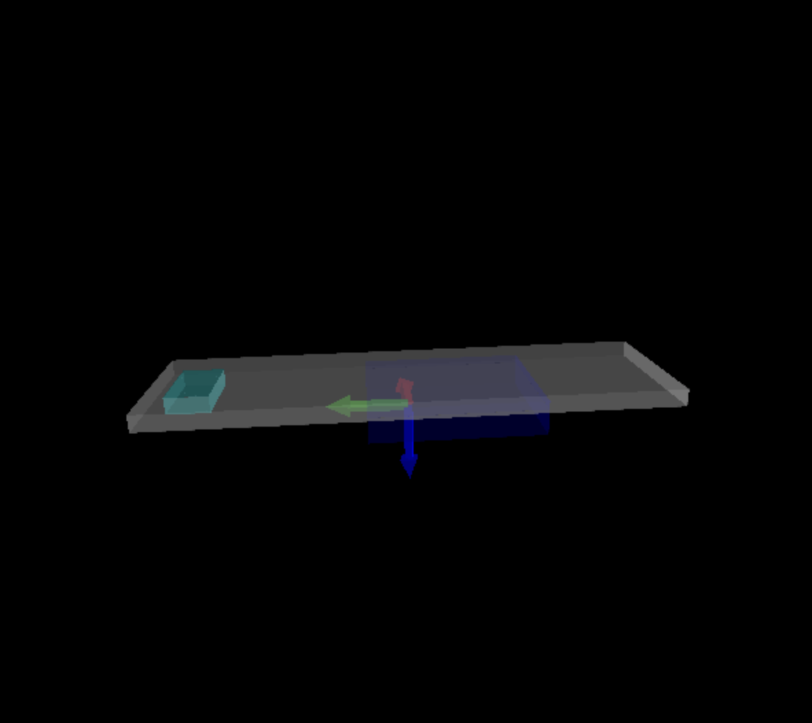

## 3D show for arduino navigation system

Use arduino UNO and mpu9250 calculate yaw, pitch and roll and print them continuously use serial, 
The Python script will get data and plot 3D graphic in Real-time. 

